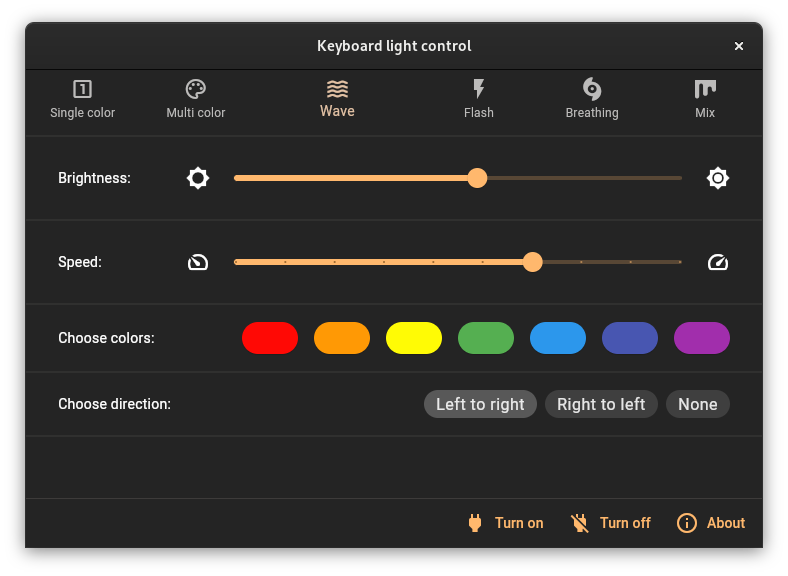

# maingear_keyboard_lights

This desktop app lets you control Integrated Technology Express keyboard lights, specifically ITE 8291 V0.2.

Tested with the Maingear Vector Pro. Should work on the Avell A52 too, as the Python script this is based on is for that machine.

This was designed to be used on Linux, since Windows already has an official tool to modify keyboard lights. Windows and Mac should be theoretically supported, but I haven't tested. If you test on those platforms, submit an issue.

Screenshot:



```
Integrated Technology Express, Inc. ITE Device(8291)
```


If you have this on `lsusb`, your laptop may be supported. For now, only revision 0.2 is supported, but feel free to pull request for another one.

Nonexhaustive list of supported laptop brands (this list isn't guaranteed to be accurate):

* Maingear 
* Tongfang
* Avell
* Schenker
* PCSpecialist
* Scan
* Overpowered
* Monster
* MECHREVO
* Raionbook
* Illegear
* Hyperbook
* SMART7
* Aftershock
* Origin-PC
* Eluktronics
* HIDevolution
* Obsidian
* Vulcan

## Credits

* https://github.com/petryx/avell-a52-lights

Recursive credits:

* https://github.com/rodgomesc/avell-unofficial-control-center
* https://github.com/kirainmoe/tongfang-utility